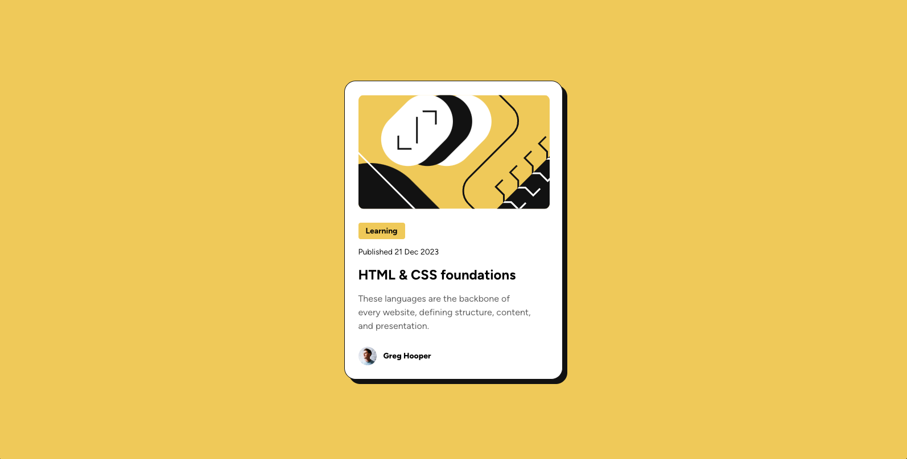

# Frontend Mentor - Blog preview card solution

This is a solution to the [Blog preview card challenge on Frontend Mentor](https://www.frontendmentor.io/challenges/blog-preview-card-ckPaj01IcS). Frontend Mentor challenges help you improve your coding skills by building realistic projects. 

## Table of contents

- [Overview](#overview)
  - [The challenge](#the-challenge)
  - [Screenshot](#screenshot)
  - [Links](#links)
- [My process](#my-process)
  - [Built with](#built-with)
  - [What I learned](#what-i-learned)
  - [Continued development](#continued-development)
  - [Useful resources](#useful-resources)
- [Author](#author)
- [Acknowledgments](#acknowledgments)

**Note: Delete this note and update the table of contents based on what sections you keep.**

## Overview
This challenge is to build out a blog preview card and get it looking as close to the design as possible.

### The challenge

Users should be able to:

- See hover and focus states for all interactive elements on the page

### Screenshot

### Links

- Solution URL: [Add solution URL here](https://github.com/Babyjenx/blog-preview-card-main)
- Live Site URL: [Add live site URL here](https://babyjenx.github.io/blog-preview-card-main/)

## My process

Building out with basic html and css. This was my first introduction to flexbox.

### Built with

– Figma
- HTML
- CSS
- Flexbox

### What I learned

I was really happy to make improvements from my last coding project. Using the CSS Reset was super helpful at getting rid of tricky overlapping margin issues. I was also able to accurately and more responsively center the design.

### Continued development

I'd like to continue learning responsiveness particularly how to come up with rem measurements instead of pixel measurements in future projects.

I also can't figuere out why my cursor: pointer; is only visible sometimes. It seems like it's just not working but it's probably an issue with my code. Any pointers would be helpful!

## Author

- Frontend Mentor - [@yourusername](https://www.frontendmentor.io/profile/yourusername)

